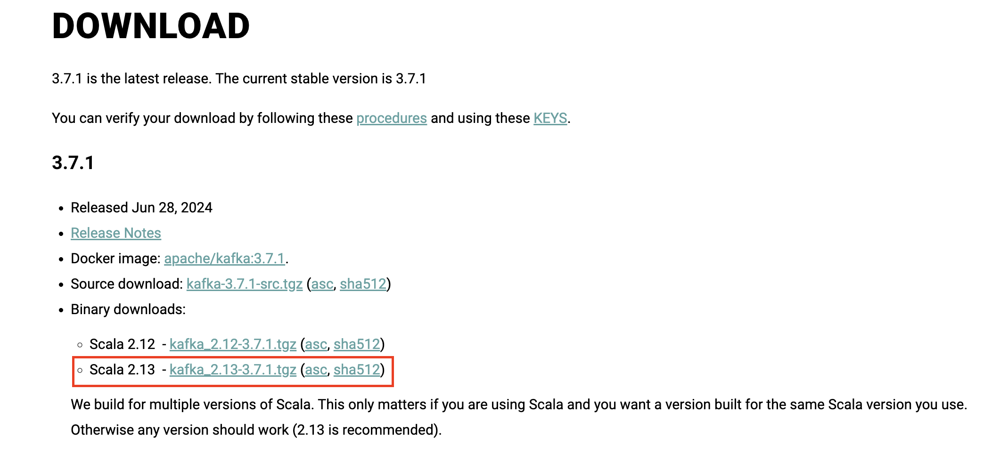

Pada dokumen ini saya ingin menulis terkait apa saja yang saya pelajari pada saat saya belajar kafka. Kalau menurut pengertiannya seperti ini 

> Kafka adalah sebuah sistem pengolahan data terdistribusi yang dirancang untuk mengolah data secara real-time. 

Intinya Kafka ini adalah sebuah message broker dimana dia bisa menerima pesan dari produser dan menyediakan pesan kepada konsumer. 

## Cara Install Kafka
Biar lebih paham, mungkin kita coba langsung saja bagaimana kafka bekerja. Langkah langkah yang akan saya ikuti bisa teman-teman akses disini ya https://kafka.apache.org/quickstart. 

### 1. Download Kafka
Kafka bisa didownload pada link berikut https://kafka.apache.org/downloads. Pada halaman tersebut pilih binary download dengan versi scala yang paling baru.



### 2. Menginstall Java Runtime
Supaya bisa menjalankan kafka kita perlu menginstall Java. Disini saya mendownload java dari [Amazon Correto](https://docs.aws.amazon.com/corretto/latest/corretto-11-ug/downloads-list.html). Download java sesuai dengan sistem operasi kalian.

### 3. Menjalankan Kafka Environment
Cara untuk bisa menjalankan kafka environment ada 3 yaitu menggunakan zookeeper, Kraft, dan Docker. Di artikel ini saya akan coba bahas yang menggunakan zookeeper. Menjalankan kafka di zookeeper perlu menjalankan 2 script yaitu 

```bash
# Start Zookeeper
$ bin/zookeeper-server-start.sh config/zookeeper.properties
```
script diatas adalah script untuk menjalankan zookeeper. Setelah zookeeper jalan, kemudian jalankan kafka di terminal yang lain
```bash
# Start the Kafka broker service
$ bin/kafka-server-start.sh config/server.properties
```
Setelah kedua script diatas jalan, kamu sudah bisa membuat produser dan konsumer untuk bermain dengan pesan secara realtime.

### 4. Membuat Topic
Sebelum bisa mencoba mengirim dan menerima pesan, kita bisa membuat topic terlebih dahulu. Topic adalah sebuah tempat untuk menampung pesan yang dikirim dari produser.
Jalankan script berikut di terminal yang baru.
```bash
$ bin/kafka-topics.sh --create --topic quickstart-events --bootstrap-server localhost:9092
```
### 5. Membuat Event
Membuat event bisa dilakukan dengan cara menjalankan script berikut di terminal yang baru
```bash
$ bin/kafka-console-producer.sh --topic quickstart-events --bootstrap-server localhost:9092
```
Setelah itu kita bisa bebas mengetik apapun pesan yang akan dikirim. Setiap baris akan menghasilkan pesan yang berbeda.

### 6. Menerima Pesan
Jalankan script berikut pada terminal yang baru 
```bash
$ bin/kafka-console-consumer.sh --topic quickstart-events --from-beginning --bootstrap-server localhost:9092
```

Maka event yang dibuat sebelumnya akan langsung terdeteksi pada terminal. Hal ini juga berlaku jika kita membuat session terminal yang baru dan menjalankan script untuk menerima pesan, maka pesan akan langsung masuk.