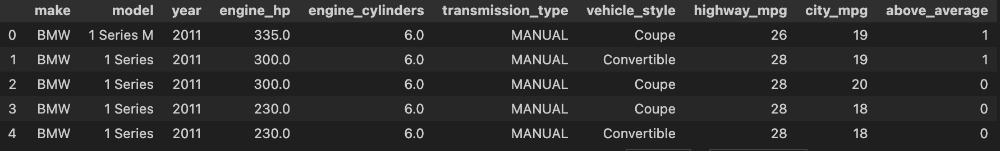
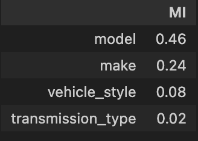

In the previous article about machine learning, we already discuss about linear regression. How to train, validate, and get the accuracy of our model. Now, I want to share about classification. Classification in machine learning used to predict categorical output, mean that the output falls into one of several predefined classes. 

Example of this like:
- Predicting churn rate of customer. (yes/no)
- Detecting spam in email. (spam/no spam)
- Diagnosing deseases (disease A, disease B, ...)

For this topic, I have learn some of concept that I can use to work with classification in machine learning like, mutual information, correlation, one-hot encoding, and logistic regression.

## Mutual Information
In classification, mutual information is often used for **feature selection** to identify which features have the most significant relationship with the target variable. By selecting features with higher mutual information with the target, you can build more efficient and effective classification models.

For example, Suppose you have a dataset for predicting customer churn (Yes/No) based on various features like age, account balance, transaction history, etc. By calculating mutual information, you might discover that "account balance" and "transaction history" have high mutual information with the churn variable, indicating that these features are strong predictors. You can then use these features to build a more focused and efficient model.

One of the advantages using the mutual information is MI can capture non-linear relationships between features and the target variable, which methods like correlation may miss. Non-linear relationship means that relationship between two variables where a change in one variable does not result in a proportional or constant change in the other variable.

## Correlation
Correlation is a way to measure how two variables are related to each other. For example, if one variable increase and the target variable also tends to increase, that's a positive correlation. If one variable increases while the target variable decrease, that's a negative correlation.

Correlation has values like this:
- 1: Perfect positive correlation (both increase together).
- -1: Perfect negative correlation (one increases while the other decreases).
- 0: No correlation (no relationship).

## One-hot Encoding
Previous part we talk about how to calculate some number that help us choosing the best feature, now I want to share about one of technique that we can use to improve prediction. One-hot encoding is a technique used in machine learning and data processing to convert categorical variables into a format that can be provided to machine learning algorithms to improve predictions. It transforms categorical data into a numerical format by creating binary (0 or 1) columns for each category.

I will give the example, let's say we have the following data:

| Color  |
|--------|
| Red    |
| Green  |
| Blue   |
| Green  |
| Red    |

After applying one-hot encoding, the data will be transformed into:

| Red | Green | Blue |
|-----|-------|------|
| 1   | 0     | 0    |
| 0   | 1     | 0    |
| 0   | 0     | 1    |
| 0   | 1     | 0    |
| 1   | 0     | 0    |

## Logistic regression
Logistic regression is a statistical method used for binary classification problems, where the goal is to predict the probability that a given input belongs to a particular category. The sigmoid function is a key component of logistic regression. Logistic regression is typically used when the outcome variable is binary, meaning it has two possible outcomes (e.g., yes/no, success/failure, spam/not spam).

## Implementation
I will follow intruction from cohort about classification in here.
### Data Preparation
For this cohorts we will using the data of the car sales. Download the data using wget

```shell
!wget https://raw.githubusercontent.com/alexeygrigorev/mlbookcamp-code/master/chapter-02-car-price/data.csv
```
and load the data into your notebook
```python
df = pd.read_csv('data.csv')
df.head()
```
For this cohort, you'll need to use only these columns:

Make,
Model,
Year,
Engine HP,
Engine Cylinders,
Transmission Type,
Vehicle Style,
highway MPG,
city mpg,
MSRP

To filter the column run following command

```python
# Filter the column
df = df[['Make', 'Model', 'Year', 'Engine HP', 'Engine Cylinders', 'Transmission Type', 'Vehicle Style', 'highway MPG', 'city mpg', 'MSRP']]
df
```
After ths we need to make our columns name is uniform, filling the null values with zero, and rename the column `MSRP` to `price`
```python
df.columns = df.columns.str.lower().str.replace(' ', '_')
# Fill the missing values with 0
df = df.fillna(0)

# rename MSRP to price
df = df.rename(columns={'msrp': 'price'})
```

For question number 2, we need to create correlation matrix between variable. to get correlation between variable we can use `corr` from pandas like this
```python
df['variable_1'].corr['variable_2']
```

Now we need to get a correlation between these variables
`engine_hp` and `year`,

`engine_hp` and `engine_cylinders`,

`highway_mpg` and `engine_cylinders`,

`highway_mpg` and `city_mpg`

You can get the correlation using `corr`
```python
engine_hp_year_corr = df['engine_hp'].corr(df['year'])
engine_hp_engine_cylinders_corr = df['engine_hp'].corr(df['engine_cylinders'])
highway_mpg_engine_cylinders_corr = df['highway_mpg'].corr(df['engine_cylinders'])
highway_mpg_city_mpg_corr = df['highway_mpg'].corr(df['city_mpg'])

#Print out the result
print(engine_hp_year_corr, engine_hp_engine_cylinders_corr, highway_mpg_engine_cylinders_corr, highway_mpg_city_mpg_corr)
```
And it will return value between -1 to 1. Negative correlation mean that as one variable increase, the other variable decrese. Positif is the opposite, as the one variable increase, the other variable increase also.

Now we need to create binary target. As we know in this dataset, the target is `MSRP` or `price` which is the continuous integer value. For classification we need to predict the binary target. So to get this target we will clasify wether the price is above average or not. To do this we need to define the average and categorize the based on price value.

```python
import numpy as np

df_data = df.copy()
above_average_price = df_data['price'].mean()
df_data['above_average'] = np.where(df['price'] >= above_average_price, 1, 0)
df_data.head()
```

It will create new column `above_average` like this image


Because we already prepare new target for this dataset we do not need column `price`. So, we can delete it.

```python
df_data = df_data.drop(['price'], axis=1)
```
### Splitting Data
In the next step we need to split the data into training, validation, and test dataset (as usual). But, ini here we use library sklearn instead of splitting it manually like in regression.

```python
from sklearn.model_selection import train_test_split

SEED=42
df_train, df_test = train_test_split(df_data, test_size=0.2, random_state=42)
df_train, df_val = train_test_split(df_train, test_size=0.25, random_state=42)

# Test the length of every dataset
len(df_train), len(df_val), len(df_test)
```
As you can see the data will split for training 60%, validation 20%, and test 20%. It will return (7148, 2383, 2383).

One more function `train_test_split` will also shuffle your data so no need to manuallty shuffle the data. Because the data is shuffle we need to reset the index to ensure that both `df_train` , `df_validation` and `df_test` have clean, sequential indices starting from 0.

```python
df_train = df_train.reset_index(drop=True)
df_val = df_val.reset_index(drop=True)
df_test = df_test.reset_index(drop=True)
```
After we split the data, we need to extract the target. As we know, that we will using `above_average` column for the target and try to classify price of the car will above average or not.
```python
y_train = df_train.above_average.values
y_val = df_val.above_average.values
y_test = df_test.above_average.values
```

### Calculate Mutual Information
After this we need to calculate mutual information of categorical variable. To get what variable is categorical, we need to search which variable has the dtype as object.
```python
df_train.dtypes

# result
make                  object
model                 object
year                   int64
engine_hp            float64
engine_cylinders     float64
transmission_type     object
vehicle_style         object
highway_mpg            int64
city_mpg               int64
above_average          int64
dtype: object
```
As you can see, the object variable is `make, model, transmission_type, and vehicle_style`. So we need to calculate mutual information value for these variable. We can use `mutual_info_score` from sklearn to calculate this.
```python
from sklearn.metrics import mutual_info_score

def get_mi_score(series):
    return mutual_info_score(series, df_train.above_average)

categorical = ['make', 'model', 'transmission_type', 'vehicle_style']

mi = df_train[categorical].apply(get_mi_score)
mi = mi.sort_values(ascending=False).to_frame(name='MI').round(2)
```
And we will get the mutual_information (MI score).


### Apply One-hot Encoding
To improve our classification prediction we need to apply one-hot encoding to our dataset. But before that, we need to remove target from our dataset
```python
# Remove target variable from the dataset
df_train = df_train.drop('above_average', axis=1)
df_val = df_val.drop('above_average', axis=1)
df_test = df_test.drop('above_average', axis=1)
```
To apply one-hot encoding, we can use DictVectorizer from sklearn (This is very useful library :))

```python
from sklearn.feature_extraction import DictVectorizer
dv = DictVectorizer(sparse=False)

# transform dataset to dictionary
train_dict = df_train.to_dict(orient='records')

# fit the dictionary to the DictVectorizer
X_train = dv.fit_transform(train_dict)
```

### Train Model
To train the classification use case, we can use LogisticRegression to train the dataset. Sklearn provide this method also.
```python
from sklearn.linear_model import LogisticRegression

model = LogisticRegression(solver='liblinear', max_iter=1000, C=10, random_state=SEED)
model.fit(X_train, y_train)
```

That's it, you have create the model for car price classification.

To get the prediction we can use validation dataset.
```python
val_dict = df_val.to_dict(orient='records')
X_val = dv.transform(val_dict)

y_pred = model.predict(X_val)
```
and to get score of our model, we can use `accuracy_score`.
```python
from sklearn.metrics import accuracy_score

accuracy = np.round(accuracy_score(y_val, y_pred),2)
print(f'Accuracy = {accuracy}')
```
How much the accuracy of your model?

## Summary
In my journey learning classification, I have learn about technique that we can use to handle classification use case. For example for classification we need to search about mutual information and correlation about two variable. This is to ensure how much that specific variable has a contribution for the prediction output. I also learn about one-hot encoding that applied to the catgorical variable to make a better prediction. Last but not least, I have learn about sklearn, this package has amazing function that help many task about machine learning.