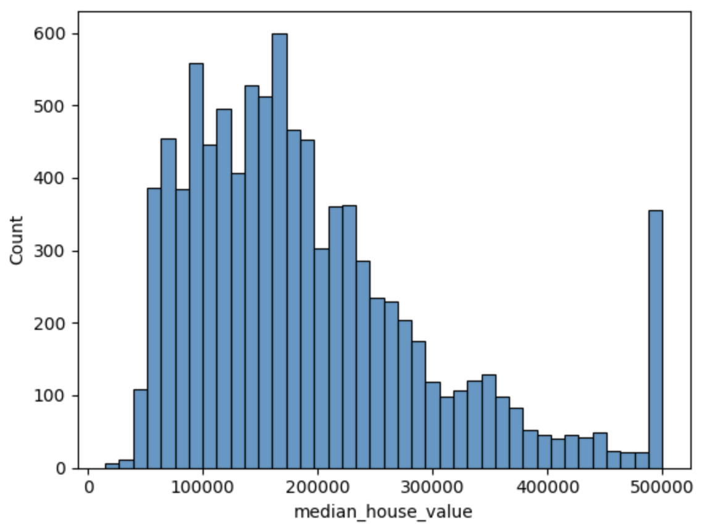

Hei everyone welcome to my blog. 
Here, I want to share what I learn about machine learning. I following this [zoomcamp](https://github.com/DataTalksClub/machine-learning-zoomcamp/tree/master) from DataClubTalk.
If you want to, just follow the link, they have zoomcamp for data engineer, MLops, and machine learning.
I am planning to write all of the material that I learn from that zoomcamp and will summarize it for my personal note and for you who want to study ML.
This article will be create on some chapter besed on the topic. So, this is the first article from my ML 101 articles.

For the disclaimer I'm didn't have strong background about math, so please help me to fix if I have wrong understanding in my article.
My study methodology will be following the zoomcamp, if I am not understand the concept I will search it and try to explain it.

## Machine Learning
Imagine you have data of house like this. Then, you want to predict what the price of house if you have new data of `Area`. You can do this prediction using Machine Learning (ML).

| Area | Price |
|------|-------|
| 100  | 200   |
| 150  | 300   |
| 120  | 250   |
| 180  | 350   |
| 200  | 400   |
| ...  | ...   |

In machine learning when you want to predict the `Price` from the `Area`. You need to feed up `Area` and `Price` to the learning algorithm and then the algorithm will create the hipothesis $h$. This hypothesis become a **function** that have a role to predict the outcome if we input new `Area`. If `Area` is $x$ then $h(x) = \hat{y}$, where $\hat{y}$ is the prediction of `Price`.

The core of ML is you must find the function $h$ that have predicted result approaches to the real result. To do that you need find the best learning algorithm to train your data. One of the learning algorithm that I want to discuss in here is **Linear Regression**.

## Linear Regression

So, what is linear regression in ML?

Linear regression is a learning algorithm to predict value by using straight line that depict the relation between dependent variable (target $y$) and independent variable (feature $x$).
$h$ could be represent in linear regression by this notation

$$
\hat{y} = w_0 + w_1x_1
$$

If the feature is two you just need add with $w_2$ and $x_2$ and so on. So, let say we have feature until $n$, so the equation will be

$$
\hat{y} = w_0 + w_1x_1 + w_2x_2 + \ldots + w_jx_j
$$

$$
\hat{y} = \sum_{i=0}^{n} w_ix_i
$$

with $x_0$ = 1 as an intercept.

In this formula, $w_0$ represents the intercept or bias term, and $w_1$ represents the weight or coefficient for the independent variable $x$. The predicted value $\hat{y}$ is calculated by multiplying the weight $w_1$ with the independent variable $x$ and adding the intercept $w_0$.

The goal of linear regression with weights is to find the best values for $w_0$ and $w_1$ that minimize the difference between the predicted values $\hat{y}$ and the actual values $y$.

One of the method that we can use to get the best value for $w$ is using Ordinary Least Square (OLS). This is the most common method to find the weights.

The equation to get $w$ in OLS
$$
w = (X^\top X)^{-1} X^\top y
$$

This will result the weights for all the feature to predict $\hat{y}$. The proses to finding the best value for $w$ is we called **training model**.

## Linear Regression in Python

With the above explanation we can try to create a simple linear regression function in python. this function will train the model to get the best value for $w$.

```python

def train_linear_regression(X, y):
    # Adding intercept
    ones = np.ones(X.shape[0])
    X = np.column_stack([ones, X])
    
    # OLS method
    XTX = X.T.dot(X)
    XTX_inv = np.linalg.inv(XTX)
    w = XTX_inv.dot(X.T).dot(y)
    
    return w[0], w[1:]

```
With $w_0$ as intercept and $w_i$ will be weights of the features.

## Implement Linear Regression

In this session I will go trough the cohorts from zoomcamp for rgression year 2023.
#### 1. Get the Dataset
For this article I will use the same dataset with the zoomcamp. You can download the dataset from here 

```
wget https://raw.githubusercontent.com/alexeygrigorev/datasets/master/housing.csv
```

We will using the `median_house_value` as the dependant variable or target.

#### 2. Prepare and Split the Dataset
In this cohorts we will filter the data as folows
- Keep only the records where `ocean_proximity` is either `'<1H OCEAN'` or `'INLAND'`.
- Next, use only the following columns:

    * `'latitude'`,
    * `'longitude'`,
    * `'housing_median_age'`,
    * `'total_rooms'`,
    * `'total_bedrooms'`,
    * `'population'`,
    * `'households'`,
    * `'median_income'`,
    * `'median_house_value'`

To do this we can filter in pandas with
```python
# Filtering the ocean proximity
df_ocean_proximity = df[df['ocean_proximity'].isin(['<1H OCEAN', 'INLAND'])]

# Filtering columns
df_partial = df_ocean_proximity[['median_house_value', 'median_income', 'total_rooms', 'housing_median_age', 'population', 'households', 'latitude', 'longitude', 'total_bedrooms']]
```

If we check the missing values
```python
df_partial.isnull().sum()
```
This will result
```
median_house_value      0
median_income           0
total_rooms             0
housing_median_age      0
population              0
households              0
latitude                0
longitude               0
total_bedrooms        157
dtype: int64
```

We will know that `total_bedrooms` have the null values. We will fill it with 0 or mean of total_bedrooms. 

Before that, we need to shuffle the data to prevent bias from the order of data. Shuffle with seed 42 as the cohort mention.
```python
df_shuffled = df_partial.sample(frac=1, random_state=42)
```

After shuffling the dta, we need to split the dataset into train, validation, and test dataset. With proportion 60%, 20%, 20%.

```python
test_val_length = int(0.2 * len(df_shuffled))
train_length = len(df_shuffled) - 2*test_val_length

df_train = df_shuffled[:train_length].copy()
df_val = df_shuffled[train_length:train_length+test_val_length].copy()
df_test = df_shuffled[train_length+test_val_length:].copy()

df_train = df_train.reset_index(drop=True)
df_val = df_val.reset_index(drop=True)
df_test = df_test.reset_index(drop=True)
```

Next step is applying log transformation to the `median_house_value` value with `np.log1p`. This action is to reducing skewness and handling outliers. Before applying the log transformation we can check the plot of data.



After we implement the transformation with
```python
y_train_orig = df_train['median_house_value'].values
y_val_orig = df_val['median_house_value'].values
y_test_orig = df_test['median_house_value'].values

y_train = np.log1p(y_train_orig)
y_val = np.log1p(y_val_orig)
y_test = np.log1p(y_test_orig)
```
We can see that the distribution became more symmetric.


After log transformation we can remove column `median_house_value` in every dataset.
```python
del df_train['median_house_value']
del df_val['median_house_value']
del df_test['median_house_value']
```

#### 3. Train Linear Regression Model
We need to create function to train the dataset using OLS as mention above.
```python
def train_linear_regression(X, y):
    
    # Adding intercept (bias) term to the input features matrix
    # Create a column of ones to represent the intercept
    ones = np.ones(X.shape[0])  # X.shape[0] gives the number of samples
    # Stack the column of ones with the input features, resulting in a new matrix
    # X with shape (n_samples, n_features + 1)
    X = np.column_stack([ones, X])
    
    # Ordinary Least Squares (OLS) method:
    # w = (X^T * X)^(-1) * X^T * y
    
    # Step 1: Compute X^T * X
    XTX = X.T.dot(X)
    
    # Step 2: Compute the inverse of X^T * X
    XTX_inv = np.linalg.inv(XTX)
    
    # Step 3: Compute the product of the inverse with X^T * y
    w = XTX_inv.dot(X.T).dot(y)
    
    # The result w is a vector where:
    # - w[0] is the intercept term (bias)
    # - w[1:] are the coefficients for the input features
    
    # Return the intercept and coefficients separately
    return w[0], w[1:]
```

Then we create the function to calculate the RMSE (Root Mean Squared Error). This function will evaluate the performance of regression model.

```python
def rmse(y, y_pred):
    # Step 1: Calculate the error (residuals) between predicted and actual values
    error = y_pred - y
    
    # Step 2: Compute the Mean Squared Error (MSE)
    # Square each error term and then compute the mean
    mse = (error ** 2).mean()
    
    # Step 3: Take the square root of MSE to obtain RMSE
    rmse_value = np.sqrt(mse)

    return rmse_value

```

Fill the null values with mean 
```python
def fill_missing_values(df, column, value):
    df[column] = df[column].fillna(value)
    return df

# Find mean of total_bedrooms
total_bedrooms_mean = df_train['total_bedrooms'].mean()

X = fill_missing_values(df_train, 'total_bedrooms', total_bedrooms_mean)
```
Train the model and find the $w_0$ and $w$
```python
w0, w = train_linear_regression(X, y_train)
```

With known $w_0$ and $w$, we can evaluate our model using dataset validation.

#### 4. Validate the Result
We will try to evaluate the model if the missing value filled with `0` or `mean` of toral bedroom.
```python
# Evaluate model with fill mean in the mising values
total_bedrooms_mean = df_train['total_bedrooms'].mean()

X = fill_missing_values(df_train, 'total_bedrooms', total_bedrooms_mean)
w0, w = train_linear_regression(X, y_train)

X_val = fill_missing_values(df_val, 'total_bedrooms', total_bedrooms_mean)
y_pred = w0 + X_val.dot(w)

# Evaluate model with fill 0 in the missing values
X = fill_missing_values(df_train, 'total_bedrooms', 0)
w0, w = train_linear_regression(X, y_train)

X_val = fill_missing_values(df_val, 'total_bedrooms', 0)
y_pred = w0 + X_val.dot(w)
```

Which model has the best output of rmse?
If we run the training and validation model above wether fill missing value with `0` or `mean` will result same performance. The greater value of RMSE mark that your model is not good, but the smaller RMSE then your model is good enough.

For question about regularization, we need to change aour function to train linear regression model. regularization is method to helps prevent overfitting by penalizing large coefficient values. If we want to using regularization then we can modify the linear regression train function to this
```python
def train_regularized_linear_regression(X, y, r=0.001):
    # Adding intercept
    ones = np.ones(X.shape[0])
    X = np.column_stack([ones, X])
    
    # OLS method
    XTX = X.T.dot(X)

    # This step modifies the original OLS solution by 
    # shrinking the coefficients, particularly when r is larger. 
    # The regularization helps prevent overfitting 
    # by penalizing large coefficient values.
    XTX = XTX + r * np.eye(XTX.shape[0])
    XTX_inv = np.linalg.inv(XTX)
    w = XTX_inv.dot(X.T).dot(y)
    
    return w[0], w[1:]
```

After this we can looping trough value $r$ to find how this modification affect our model.
```python
for r in [0, 0.000001, 0.0001, 0.001, 0.01, 0.1, 1, 5, 10]:
    w_0, w = train_regularized_linear_regression(df_train, y_train, r=r)
    y_pred = w_0 + X_val.dot(w)
    rmse_val = rmse(y_val, y_pred)
    print('%06s %0.11f' % (r, rmse_val))
```

This will result rmse of every $r$ value. Choose the smallest value of rmse, to determine which $r$ should we use.

## Summary

In summary, linear regression is a machine learning algorithm used to predict a continuous dependent variable based on one or more independent variables. The goal of linear regression is to find the best values for the weights that minimize the difference between the predicted values and the actual values. This can be achieved using the Ordinary Least Squares (OLS). Linear regression is a simple yet powerful algorithm for predicting continuous variables. By finding the best values for the weights using the OLS method, we can create a linear regression model that accurately predicts the dependent variable based on the independent variables.

I learn a lot from this learning, the fear of learning machine learning is you need to understand of statistic and math, but the opposite I feel interested to learn more. See you in the next article.
